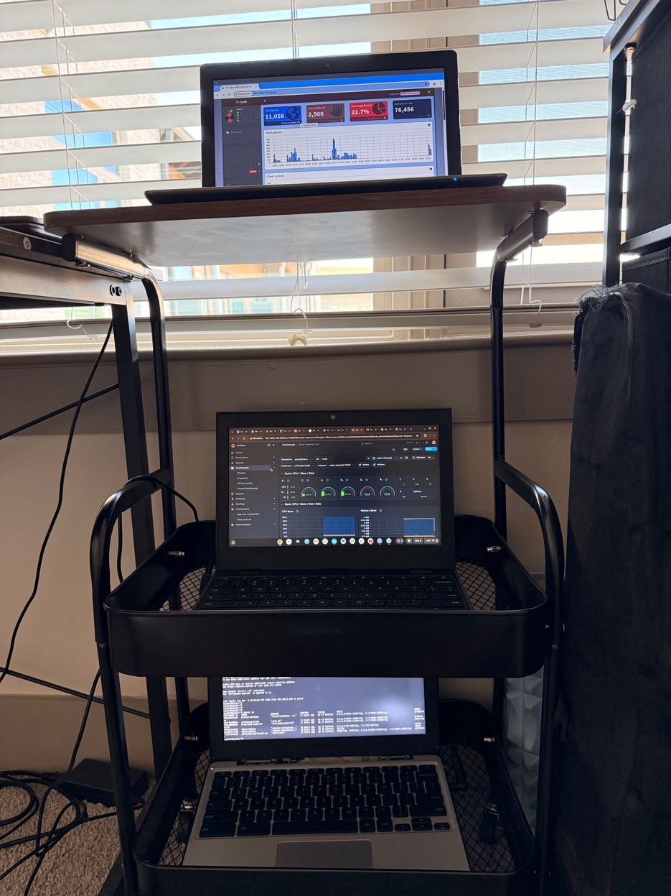

# Zero Cloud Home Lab

<div align="center">


**3 Chromebooks. No AWS. No cloud bills. Just raw metal on the internet.**

*Self-hosted. Zero cloud. Always on. 100% yours.*

</div>

---

## 📸 The Setup



| Shelf | Machine | OS | Role | RAM | Storage |
|-------|---------|-----|------|-----|---------|
| 🔝 Top | Chromebook #1 | Ubuntu Server (CLI) | Web Server + Docker + Cloudflare Tunnel + PicoClaw | 4GB | 16GB + 32GB `/home` |
| 🖥️ Middle | Chromebook #2 | Zorin OS | Grafana + Prometheus + Monitoring dashboards | 4GB | 16GB |
| 💻 Bottom | Chromebook #3 | ChromeOS | Daily driver — SSH control, Grafana viewer, everything | 4GB | 16GB |

> 3 Chromebooks on a rack shelf. Pi-hole network firewall. Cloudflare tunnel. Zero cloud. 💪

---

## 🌐 Network Architecture

```
Internet
    │
    ▼
┌─────────────────────┐
│  Dedicated Router   │  ← home network routing
└─────────────────────┘
    │
    ▼
┌─────────────────────┐
│  Pi-hole + UFW      │  ← Chromebook #2 (Zorin OS)
│  DHCP + Firewall    │     blocks ads network-wide
│  network-wide DNS   │     controls all traffic
└─────────────────────┘
    │
    ├──────────────────────────────────┐
    ▼                                  ▼
┌─────────────────────┐    ┌─────────────────────┐
│  Chromebook #1      │    │  Chromebook #2       │
│  Ubuntu Server CLI  │    │  Zorin OS            │
│                     │    │                      │
│  Docker Engine      │    │  Grafana  :3000       │
│  ├── Nginx    :80   │    │  Prometheus :9090     │
│  ├── Portainer:9000 │    │  Node Exporter :9100  │
│  └── Cloudflared    │    └─────────────────────┘
│                     │
│  PicoClaw Agent     │  ← AI agent for mobile control
│  32GB /home mount   │  ← Docker storage
└─────────────────────┘
    │
    ▼
Cloudflare Tunnel → Internet (HTTPS, free, no port forwarding)
    │
    ▼
┌─────────────────────┐
│  Chromebook #3      │  ← your daily driver
│  ChromeOS           │
│  SSH → CB#1 & CB#2  │
│  Grafana browser    │
│  Mobile via PicoClaw│
└─────────────────────┘
```

---

## ✅ Roadmap

| # | Week | Topic | Status |
|---|------|-------|--------|
| 1 | Week 1 | Ubuntu Server + Docker + Nginx + Cloudflare Tunnel | ✅ Complete |
| 2 | Week 2 | Prometheus + Grafana Monitoring Stack | ✅ Complete |
| 3 | Week 3 | Gitea + Drone CI (Self-hosted GitOps) | 🔄 In Progress |
| 4 | Week 4 | k3s Kubernetes + App Manifests | ⏳ Pending |
| 5 | Week 5 | Terraform (Infrastructure as Code) | ⏳ Pending |
| 6 | Week 6 | SSL via Let's Encrypt + Domain Routing | ⏳ Pending |

---

## 🚀 Running Stack

| Service | Machine | Port | Public URL | Purpose |
|---------|---------|------|------------|---------|
| Nginx | CB#1 | `:80` | [ayush1.xyz](https://ayush1.xyz) | Web server / reverse proxy |
| Portainer | CB#1 | `:9000` | [portainer.ayush1.xyz](https://portainer.ayush1.xyz) | Docker visual management GUI |
| Cloudflared | CB#1 | systemd | - | Cloudflare Tunnel — always on |
| PicoClaw | CB#1 | - | - | AI agent — mobile remote control |
| Prometheus | CB#2 | `:9090` | - | Metrics collection & storage |
| Grafana | CB#2 | `:3000` | [grafana.ayush1.xyz](https://grafana.ayush1.xyz) | Monitoring dashboards |
| Node Exporter | CB#2 | `:9100` | - | Linux system metrics |
| Pi-hole | CB#2 | `:80` | - | Network-wide ad blocking + DHCP |


---

## 📦 Week 1 — Web Server Setup (Chromebook #1)

### Install Ubuntu Server
```bash
# After installing Ubuntu Server 24.04 LTS via USB
sudo apt update && sudo apt upgrade -y

# Prevent laptop from sleeping on lid close
sudo nano /etc/systemd/logind.conf
# Set: HandleLidSwitch=ignore
sudo systemctl restart systemd-logind
```

### Mount 32GB Extended Storage
```bash
# Find the device
lsblk

# Format (if new)
sudo mkfs.ext4 /dev/mmcblk1p1

# Mount to /home
sudo mount /dev/mmcblk1p1 /home

# Make permanent on boot
echo '/dev/mmcblk1p1 /home ext4 defaults 0 2' | sudo tee -a /etc/fstab

# Verify
df -h
# /home should show ~27-30GB available
```

### Move Docker Storage to /home
```bash
sudo systemctl stop docker
sudo systemctl stop docker.socket
sudo mkdir -p /home/docker
sudo mv /var/lib/docker /home/docker/lib
sudo nano /etc/docker/daemon.json
```
```json
{
  "data-root": "/home/docker/lib"
}
```
```bash
sudo systemctl start docker
docker info | grep "Docker Root Dir"
# → Docker Root Dir: /home/docker/lib ✅
```

### Set Static IP
```bash
sudo nano /etc/netplan/00-installer-config.yaml
```
```yaml
network:
  ethernets:
    eth0:
      addresses: [192.168.1.100/24]
      gateway4: 192.168.1.1
      nameservers:
        addresses: [8.8.8.8, 1.1.1.1]
      dhcp4: false
  version: 2
```
```bash
sudo netplan apply
```

### SSH Key Auth
```bash
# On Chromebook #3 (ChromeOS)
ssh-keygen -t ed25519 -C "zero-cloud-lab"
ssh-copy-id user@192.168.1.100
```

### Firewall
```bash
sudo ufw allow OpenSSH
sudo ufw allow 80
sudo ufw allow 443
sudo ufw allow 9000
sudo ufw enable
sudo ufw status
```

### Install Docker
```bash
curl -fsSL https://get.docker.com | sh
sudo usermod -aG docker $USER
newgrp docker
sudo apt install docker-compose-plugin -y
docker compose version
```

### Deploy Portainer
```bash
docker volume create portainer_data

docker run -d \
  --name portainer \
  --restart always \
  -p 9000:9000 \
  -v /var/run/docker.sock:/var/run/docker.sock \
  -v portainer_data:/data \
  portainer/portainer-ce
```

### Deploy Nginx
```bash
mkdir -p ~/server/nginx/html
mkdir -p ~/server/nginx/conf

echo "<h1>Zero Cloud Home Lab 🚀</h1>" > ~/server/nginx/html/index.html

docker run -d \
  --name nginx \
  --restart always \
  -p 80:80 \
  -v ~/server/nginx/html:/usr/share/nginx/html \
  -v ~/server/nginx/conf:/etc/nginx/conf.d \
  nginx:alpine

curl http://localhost:80
```

### Cloudflare Tunnel
```bash
# Install
sudo curl -L https://github.com/cloudflare/cloudflared/releases/latest/download/cloudflared-linux-amd64 \
  -o /usr/local/bin/cloudflared
sudo chmod +x /usr/local/bin/cloudflared

# Install as permanent service (token from Cloudflare dashboard)
sudo cloudflared service install YOUR_TOKEN_HERE
sudo systemctl enable cloudflared
sudo systemctl start cloudflared

# Fix connection drops — force HTTP2
cloudflared tunnel --url http://localhost:80 --protocol http2
```

### PicoClaw — AI Mobile Agent
```bash
# PicoClaw is an ultra-lightweight AI agent
# running on CB#1 that allows you to control
# the web server remotely from your mobile device
# via natural language commands

# Check status
sudo systemctl status picoclaw
```

---

## 📊 Week 2 — Monitoring Stack (Chromebook #2)

### Folder Setup
```bash
mkdir -p ~/server/monitoring
cd ~/server/monitoring
```

### `docker-compose.yml`
```yaml
version: '3'

services:
  prometheus:
    image: prom/prometheus
    container_name: prometheus
    restart: always
    ports:
      - "9090:9090"
    volumes:
      - ./prometheus.yml:/etc/prometheus/prometheus.yml
      - prometheus_data:/prometheus

  grafana:
    image: grafana/grafana
    container_name: grafana
    restart: always
    ports:
      - "3000:3000"
    volumes:
      - grafana_data:/var/lib/grafana
    environment:
      - GF_SECURITY_ADMIN_PASSWORD=admin123

  node-exporter:
    image: prom/node-exporter
    container_name: node-exporter
    restart: always
    ports:
      - "9100:9100"

volumes:
  prometheus_data:
  grafana_data:
```

### `prometheus.yml`
```yaml
global:
  scrape_interval: 15s

scrape_configs:
  - job_name: 'prometheus'
    static_configs:
      - targets: ['localhost:9090']

  - job_name: 'node'
    static_configs:
      - targets: ['node-exporter:9100']
```

```bash
docker compose up -d
docker ps
```

### Configure Grafana
```
1. Open http://CB2_IP:3000
2. Login: admin / admin123
3. Connections → Data Sources → Prometheus
4. URL: http://prometheus:9090 → Save & Test ✅
5. Dashboards → Import → ID: 1860 → Import
```

---

## 🕳️ Pi-hole Setup (Chromebook #2 — Zorin OS)

```bash
# Install Pi-hole
curl -sSL https://install.pi-hole.net | bash

# Set as DHCP server in Pi-hole admin
# http://CB2_IP/admin → Settings → DHCP → Enable

# Point router DNS to CB#2 IP
# Router settings → DNS → 192.168.1.x (CB#2 IP)

# View stats
pihole -c          # console stats
pihole -t          # tail live logs
pihole updateGravity  # update blocklists
```

---

## 🐳 Docker Cheatsheet

```bash
# Container management
docker ps                            # list running containers
docker ps -a                         # all containers
docker restart nginx                 # restart container
docker logs -f nginx                 # follow logs live
docker stats                         # live CPU/RAM per container
docker exec -it nginx sh             # shell into container

# Files
docker cp file.html nginx:/usr/share/nginx/html/

# Compose
docker compose up -d                 # start stack
docker compose down                  # stop stack
docker compose logs -f               # follow logs

# Cleanup
docker system prune -a               # remove unused images
docker info | grep "Docker Root Dir" # check storage location
```

---

## 🖥️ System Cheatsheet

```bash
# Disk & Memory
df -h                    # disk usage
free -h                  # RAM usage
lsblk                    # list block devices / partitions
htop                     # process monitor

# SSH from Chromebook #3
ssh user@CB1_IP          # into web server
ssh user@CB2_IP          # into monitoring machine

# Services
sudo systemctl status cloudflared
sudo systemctl status picoclaw
sudo systemctl restart nginx

# Screen (background processes)
screen -S tunnel         # start session
# Ctrl+A D               # detach
screen -r tunnel         # reattach
```

---

## 📁 Folder Structure

```
~/server/
├── nginx/
│   ├── html/
│   │   └── index.html
│   └── conf/
│       └── default.conf
└── monitoring/
    ├── docker-compose.yml
    └── prometheus.yml

/home/docker/lib/        ← Docker on 32GB partition
/etc/docker/daemon.json  ← Docker config
/etc/fstab               ← 32GB mount config
```

---

## 🔧 Troubleshooting

<details>
<summary><b>Tunnel keeps dropping</b></summary>

```bash
sudo pkill cloudflared
cloudflared tunnel --url http://localhost:80 --protocol http2

# Permanent fix
sudo nano /etc/systemd/system/cloudflared.service
# Add --protocol http2 to ExecStart
sudo systemctl daemon-reload && sudo systemctl restart cloudflared
```
</details>

<details>
<summary><b>502 Bad Gateway</b></summary>

```bash
docker ps
curl http://localhost:80
docker logs nginx
docker restart nginx
```
</details>

<details>
<summary><b>Disk space full on root</b></summary>

```bash
df -h
docker system prune -a
sudo apt autoremove && sudo apt clean
sudo journalctl --vacuum-time=7d
```
</details>

<details>
<summary><b>32GB /home not mounted after reboot</b></summary>

```bash
lsblk                    # find device name
sudo mount /dev/mmcblk1p1 /home
# If missing from fstab:
echo '/dev/mmcblk1p1 /home ext4 defaults 0 2' | sudo tee -a /etc/fstab
```
</details>

<details>
<summary><b>Pi-hole not blocking ads</b></summary>

```bash
pihole status
pihole restartdns
pihole updateGravity
# Check router DNS is pointing to CB#2 IP
```
</details>

---

## 🔐 Security Checklist

- [x] UFW firewall on all machines
- [x] SSH key auth only (no passwords)
- [x] Root SSH login disabled
- [x] Cloudflare Tunnel (zero open inbound ports)
- [x] Pi-hole network firewall + ad blocking
- [x] Docker storage on separate 32GB partition
- [x] PicoClaw for secure mobile access
- [ ] Fail2ban (coming Week 6)
- [ ] SSL certificates (coming Week 6)

---

## 📚 Resources

- [Cloudflare Tunnel Docs](https://developers.cloudflare.com/cloudflare-one/connections/connect-apps/)
- [Pi-hole Docs](https://docs.pi-hole.net/)
- [Prometheus Docs](https://prometheus.io/docs/)
- [Grafana Docs](https://grafana.com/docs/)
- [Docker Docs](https://docs.docker.com/)
- [roadmap.sh/devops](https://roadmap.sh/devops)

---

## 🐙 Push to GitHub

### Step 1 — Create Repo
```
1. github.com → New repository
2. Name: zero-cloud-home-lab
3. Description: 3 Chromebooks. No AWS. No cloud bills. Self-hosted DevOps lab.
4. Public
5. Do NOT initialize with README
6. Create repository
```

### Step 2 — Set Up Locally
```bash
mkdir zero-cloud-home-lab && cd zero-cloud-home-lab

# Copy config files
cp ~/server/monitoring/docker-compose.yml ./monitoring/docker-compose.yml
cp ~/server/monitoring/prometheus.yml ./monitoring/prometheus.yml

# Add README.md and setup.jpeg into this folder
```

### Step 3 — Push
```bash
git init
git add .
git commit -m "feat: zero cloud home lab — week 1 & 2 complete"
git branch -M main
git remote add origin https://github.com/YOUR_USERNAME/zero-cloud-home-lab.git
git push -u origin main
```

### Step 4 — Update Each Week
```bash
git add .
git commit -m "feat: week 3 — gitea + drone CI"
git push
```

---

<div align="center">

**Built by Ayush** · March 2026 · Zero Cloud Home Lab

*3 Chromebooks. 1 rack. Zero AWS. No AWS was harmed in the making of this project.*

*Leave a ⭐ if this inspired you.*

</div>
